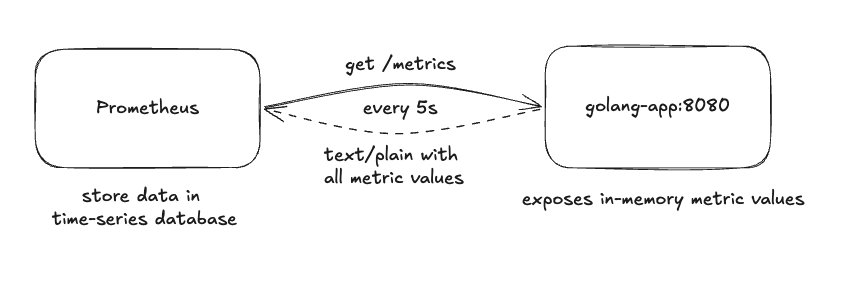
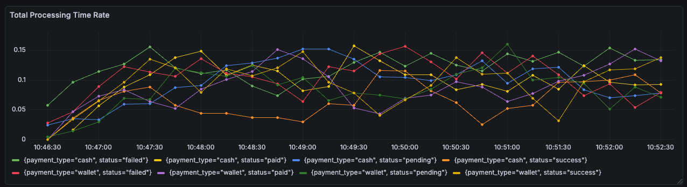
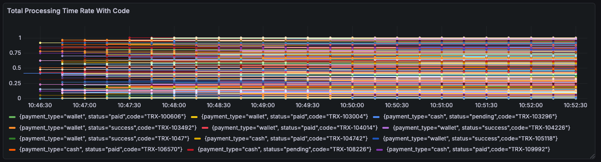

# The Dangers of High-Cardinality Labels in Prometheus

We're all familiar with the warnings: *"Don't use user_id as a Prometheus label,"* or *"Don't use transaction codes as labels — they can crash Prometheus"*. But do we really understand **why** these are so dangerous? 

Before that, we need to know how Prometheus works.

## How Prometheus Works

Prometheus is an open-source systems monitoring and alerting tool that collects and stores its metrics as time-series data. It periodically scrapes metrics from your services based on the configured interval.

This is an example of the config:

```yaml
scrape_configs:
  - job_name: 'golang-app'
    static_configs:
      - targets: ['localhost:8080']
    scrape_interval: 5s
```

This config will tell Prometheus to:

- **Target**: send an HTTP request GET to `http://localhost:8080/metrics`
- **Periodically**: for every 5 seconds
- **Label**: with `job=golang-app`



Prometheus has three metric types:

- **Gauges** represent current measurements and reflect the current state of a system, such as CPU usage and memory usage.
- **Counters** measure discrete events that continuously increase over time. Common examples are the number of HTTP requests received, CPU seconds spent, and bytes sent.
- **Histogram** tracks the distribution of observed values. For a base metric name `<basename>`, it exposes multiple related time series:
`<basename>_bucket{le="..."}` — Cumulative counters representing the number of observations that fall within each bucket boundary
`<basename>_sum` — The total sum of all observed values
`<basename>_count` — The count of events that have been observed

## Time Series Database (TSDB)

Prometheus collects and stores metrics as time series. Each time series is uniquely identified by a metric name and a set of labels, while each sample within the series contains a timestamp and a value. Each unique combination of labels (method, path, and status) represents a separate time series whose value increases as more requests are processed, with total `method x path x status`.

In the Counter metrics example, suppose we have two endpoints: `GET: /api/data`, `GET: /api/users`, and each of which can return either a `200` or `500` status code. This results in the following metrics:

```
http_requests_total{method="GET", path="/api/data",  status="200"} 17
http_requests_total{method="GET", path="/api/data",  status="500"} 0
http_requests_total{method="GET", path="/api/users", status="200"} 10
http_requests_total{method="GET", path="/api/users", status="500"} 2
```

Because each time series represents a *unique combination of labels*, these four label combinations produce *four distinct time series*. In the time-series database (TSDB), each of these time series is stored independently:

```
// time series 1
2026-02-19 09:00:00 | {__name__="http_requests_total", method="GET", path="/api/data", status="200"} | 15
2026-02-19 09:00:05 | {__name__="http_requests_total", method="GET", path="/api/data", status="200"} | 16
2026-02-19 09:00:10 | {__name__="http_requests_total", method="GET", path="/api/data", status="200"} | 17

// time series 2
2026-02-19 09:00:00 | {__name__="http_requests_total", method="GET", path="/api/data", status="500"} | 0
2026-02-19 09:00:05 | {__name__="http_requests_total", method="GET", path="/api/data", status="500"} | 0
2026-02-19 09:00:10 | {__name__="http_requests_total", method="GET", path="/api/data", status="500"} | 0

// time series 3
2026-02-19 09:00:00 | {__name__="http_requests_total", method="GET", path="/api/users", status="200"} | 8
2026-02-19 09:00:05 | {__name__="http_requests_total", method="GET", path="/api/users", status="200"} | 9
2026-02-19 09:00:10 | {__name__="http_requests_total", method="GET", path="/api/users", status="200"} | 10

// time series 4
2026-02-19 09:00:00 | {__name__="http_requests_total", method="GET", path="/api/users", status="500"} | 1
2026-02-19 09:00:05 | {__name__="http_requests_total", method="GET", path="/api/users", status="500"} | 2
2026-02-19 09:00:10 | {__name__="http_requests_total", method="GET", path="/api/users", status="500"} | 2
```

## The Dangers

Let's go back to the warning: *"Don't use user_id as a Prometheus label,"* or *"Don't use transaction codes as labels — they can crash Prometheus."*

Now, imagine you want to record transaction activity using metric labels such as:

- `status`: `pending`, `paid`, `success`, `failed`
- `payment_type`: `wallet`, `cash`

Here, `status` has 4 possible values, `payment_type` has 2 possible values. It will produce `status (4) x payment_type (2) = 8 time series`. This is the example result of the metrics



Then, you adjust the metrics by adding a `code` label, allowing request rates, error rates, and traffic patterns to be broken down per transaction

- `code`: a unique identifier for each transaction

However, `code` is unique for every transaction and grows continuously with request volume. As a result, the number of possible values for code is **unbounded** and **increases over time**. `status (4) × payment_type (2) × code (∞) = ∞ time series`

This is the example result of the metrics



This single unbounded label is enough to turn an otherwise manageable metric into a high-cardinality time-series explosion that can cause memory exhaustion and query performance.

## Summary

Adding labels whose values grow unbounded over time—such as UUIDs, timestamps, user IDs, or transaction codes—is strongly discouraged. These labels rarely add meaningful value at the metrics level and introduce high cardinality. For high-cardinality data, better use logging, not metrics

High-cardinality labels can lead to serious issues, including:
- **Huge memory usage** — each unique label set creates a new time series
- **Rapid disk growth**
- **Slow queries**
- **Scrape performance issue**

its better to use labels that have semantic meaning, and strongly recommended to keep the number of labels to a minimum

> A wise man says, *"Never use a label whose value grows with users, requests, or time."*

**Good labels describe what something *is*, not *who* or which exact instance.**
